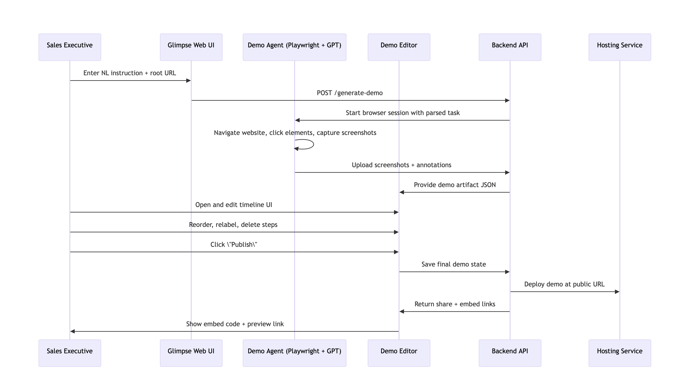

# Technical Implementation Plan – Glimpse

## Objective

Build a simple web app that enables users to generate interactive product demos from natural language instructions using two main components: a **demo agent** and a **demo editor**. The system should support capturing annotated screenshots of browser interactions and providing an interface for editing and publishing the final demo.

---

## 1. System Architecture Overview




### A. Web App Views

- **Landing Page / Input Interface**  
  - **Input:** Natural language task description and website root URL.  
  - **Output:** Triggers execution in the demo agent.

- **Demo Editor UI**  
  - **Input:** Annotated screenshots and text from the demo agent.  
  - **Function:** Allow the user to edit, reorder, re-annotate, and publish.

- **Published Demo Viewer**  
  - **Output:** Embeddable link to final interactive walkthrough.

### B. Subsystems

- **Demo Agent** (Automation + Annotation Engine)  
- **Demo Editor** (Frontend UI + Publishing Engine)

---

## 2. Demo Agent Subsystem

### Responsibilities

- Parse natural language instruction and plan a goal-driven browser interaction.
- Use headless browser automation to interact with the site.
- Capture screenshots before each interaction.
- Track the element being clicked and record normalized coordinates.
- Generate descriptive annotations for each step.

### Tech Stack Recommendation

- **Language:** Python  
- **Automation:** Playwright (preferred over Puppeteer)  
- **Headless Environment:** Playwright in headless Chromium  
- **Parsing:** OpenAI GPT-4 (or Anthropic Claude)  
- **Orchestration:** FastAPI  

### Artifacts per Step

- `screenshot.png`
- `metadata.json`:
```json
{
  "click_position": {
    "x": 230,
    "y": 410,
    "page_width": 1440,
    "page_height": 1024
  },
  "click_label": "Click here to try the API",
  "element_selector": "#try-api-button",
  "url": "https://example.com/docs/api"
}
```
Annotation Coordinates
	•	Represented relative to page size: (x / page_width, y / page_height)
	•	Editor re-computes coordinates dynamically on window resize.

⸻

3. Demo Editor Subsystem

Responsibilities
	•	Accept structured input (screenshots, annotations, descriptions).
	•	Provide timeline-based view of captured steps.
	•	Enable inline editing of labels, repositioning annotations, and reordering/removal.
	•	Publish to unique demo page + embed snippet.

Tech Stack Recommendation
	•	Framework: React + Tailwind CSS
	•	Editor State: Redux Toolkit or Zustand
	•	Image Rendering: Canvas or SVG overlays
	•	Hosting: Static hosting (e.g. Vercel, Netlify)
	•	Backend: FastAPI (shared)

⸻

4. API Interface Definitions

Interface 1: Main Page → Demo Agent
	•	Endpoint: POST /generate-demo
	•	Payload:
```
{
  "nl_task": "The engineering team released a new feature where you can try the API directly from their website",
  "root_url": "https://example.com"
}

	•	Response: 202 Accepted + Job ID
	•	Polling/Callback: GET /demo-status/{job_id}
	•	Final Output: List of steps with screenshot and metadata
```
Interface 2: Demo Agent → Demo Editor
	•	Format: JSON descriptor of full demo
```
{
  "demo_id": "demo_xyz",
  "steps": [
    {
      "screenshot_url": "https://glimpse.app/assets/demo_xyz/step1.png",
      "annotation": {
        "text": "Click here to try the API",
        "rel_x": 0.16,
        "rel_y": 0.40
      },
      "element_selector": "#try-api-button",
      "url": "https://example.com/docs/api"
    }
  ]
}
```

⸻

5. Publishing Workflow
	•	User Action: Clicks "Publish"
	•	Backend: Saves final state to demo DB
	•	Output:
	•	Hosted demo at: https://glimpse.app/demo/{id}
	•	Embed code:

<iframe src="https://glimpse.app/demo/{id}" width="100%" height="600px" frameborder="0"></iframe>


⸻